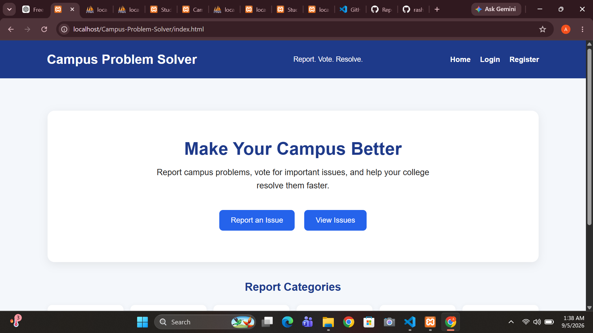
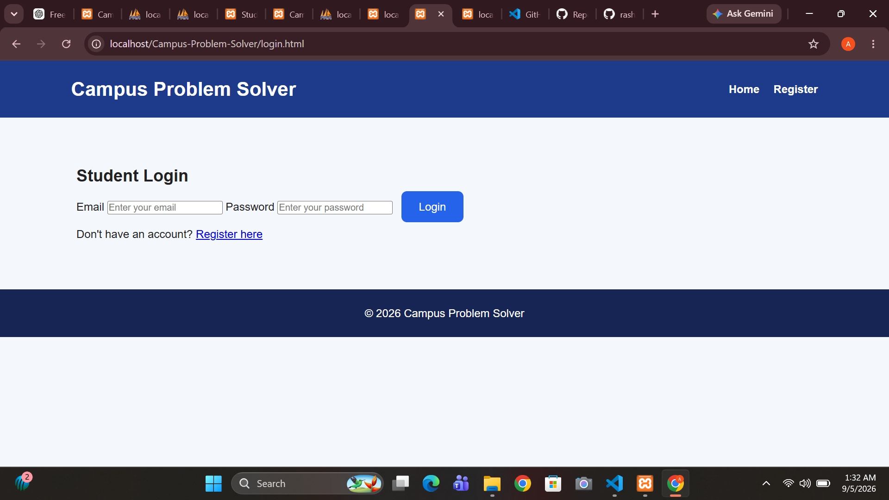
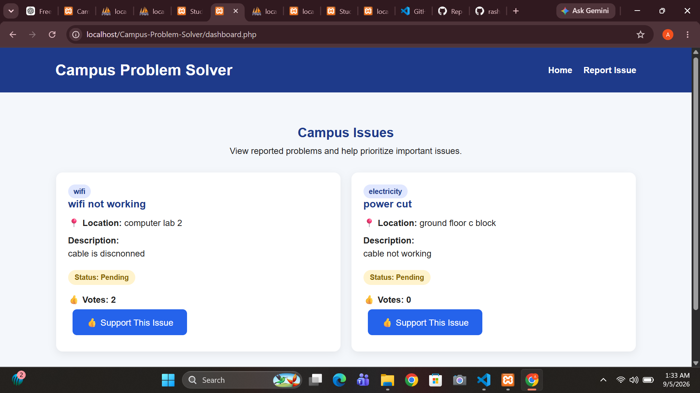

# Campus Problem Solver 🏫

A full-stack web application designed to help students report, prioritize, and track problems across their campus.

## 🎯 Problem Statement

Campus issues such as broken fans, water leakage, Wi-Fi problems, cleanliness, parking, electricity, hostel issues, and other facilities may be difficult to report and track efficiently.

**Campus Problem Solver** provides a centralized platform where students can report issues and collectively prioritize them through community voting, while administrators can manage and track their resolution.

## 🚀 Features

### 👨‍🎓 Student Features

- Student registration and login
- Secure authentication with session management
- Report campus issues with:
  - Title
  - Category
  - Location
  - Description
  - Photo
- Anonymous issue reporting
- View reported campus issues
- Vote on important issues
- One-vote-per-student protection
- Track issue status

### 👨‍💼 Admin Features

- Admin authentication
- View reported campus issues
- Monitor community votes
- Update issue status
- Manage issue resolution workflow

### 🔐 Security Features

- Password hashing using PHP
- Prepared SQL statements
- Session-based authentication
- Server-side input validation
- File type and size validation
- Secure image upload handling
- Role-based authorization

## 🛠️ Tech Stack

| Technology | Purpose |
|---|---|
| HTML | Structure |
| CSS | Styling and responsive UI |
| JavaScript | Client-side interactions |
| PHP | Backend and server-side logic |
| MySQL | Database management |
| XAMPP | Local development environment |

## 📂 Project Structure

```text
Campus-Problem-Solver/
│
├── index.html
├── login.html
├── register.html
├── dashboard.php
├── report.html
├── admin.php
│
├── css/
│   └── style.css
│
├── js/
│   └── script.js
│
├── php/
│   ├── db.php
│   ├── login.php
│   ├── register.php
│   ├── logout.php
│   ├── submit_issue.php
│   ├── vote.php
│   └── update_status.php
│
├── uploads/
│
└── screenshots/
```

## ⚙️ How to Run Locally

### 1. Install XAMPP

Install XAMPP and start:

- Apache
- MySQL

### 2. Place the Project

Copy the project into your XAMPP `htdocs` directory.

### 3. Create the Database

Open:

```text
http://localhost/phpmyadmin/
```

Create a database named:

```text
campus_problem_solver
```

Import the project's SQL database.

### 4. Configure Database Connection

Update the database credentials in:

```text
php/db.php
```

### 5. Open the Application

Visit:

```text
http://localhost/Campus-Problem-Solver/
```

## 📸 Screenshots

### Home Page



### Student Login



### Issue Dashboard



## 🌱 Future Improvements

- Email notifications for issue updates
- Advanced issue filtering and search
- Issue priority levels
- Analytics dashboard
- Improved mobile responsiveness
- Cloud deployment
- Additional role-based features

## 👩‍💻 Author

**Anshika Srivastava**

BCA Student | Aspiring Software Developer

- GitHub: [rashilala009-stack](https://github.com/rashilala009-stack)
- LinkedIn: [Anshika Srivastava](https://linkedin.com/in/anshika-srivastava-515b61360)

---

⭐ If you find this project useful, consider giving it a star!
